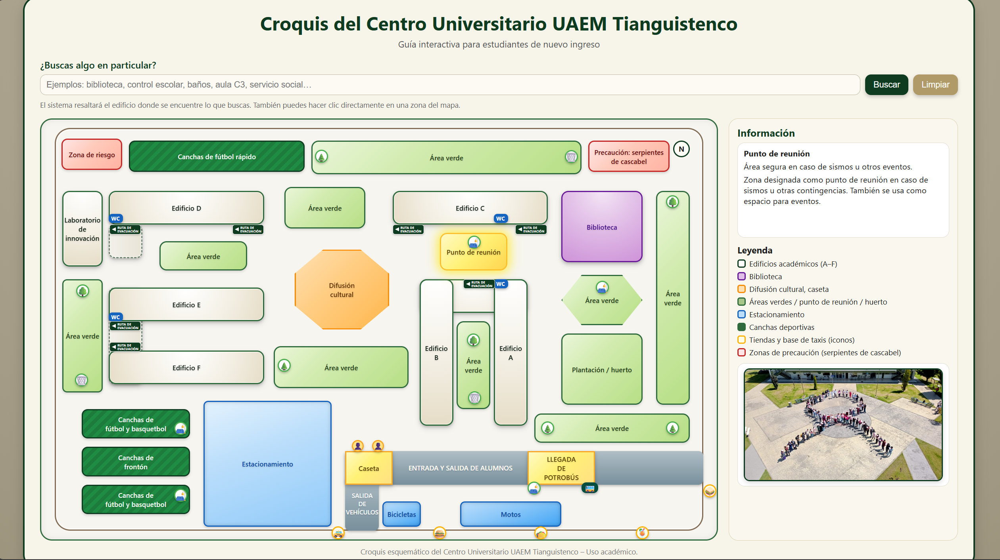

# 🗺️ Croquis Interactivo del Centro Universitario UAEM Tianguistenco

Este proyecto es una **guía interactiva** diseñada especialmente para estudiantes de nuevo ingreso del Centro Universitario UAEM Tianguistenco.  
Permite explorar el campus, ubicar edificios, zonas deportivas, áreas verdes, pasillos, comercios y accesos mediante un mapa clickeable con información detallada.

---

## Tecnologías utilizadas

- **HTML5** → estructura del croquis y panel informativo
- **CSS3** → diseño visual, colores institucionales UAEM y accesibilidad
- **JavaScript** → búsqueda por palabras clave + resaltado dinámico + fotos informativas
- Diseño **responsivo y accesible** para dispositivos móviles

---

## ✨ Funcionalidades principales

| Función | Descripción |
|--------|-------------|
| 🔍 Buscador inteligente | Localiza edificios, aulas, servicios y áreas con sinónimos (ej: *“control escolar”, “canchas”, “biblioteca”*) |
| 🖱️ Zonas clickeables | Cada área del campus muestra descripción e imagen |
| 🧭 Rutas de evacuación | Señalamientos interactivos en caso de emergencia |
| 🧑‍🏫 Información detallada | Panel informativo accesible y con apoyo visual |
| 🚌 Transporte | Indica llegada del Potrobús y base de taxis |
| 🚮 Mobiliario | Botes de basura, bancas y arbolado representado |
| 🚻 Servicios | Baños identificados con íconos WC |

---

## 📌 Vista en línea (GitHub Pages)

🔗 Proyecto disponible aquí:  
> https://raulsebastian-bk.github.io/Integrativa-Profesional/

## 📁 Descarga del proyecto en ZIP

Puedes descargar el proyecto completo para uso local:

## 📂 Estructura del proyecto

📦 Integrativa_Profesional
├── index.html
├── style.css
├── app.js
├── README.md
├── img/
│ ├── Edificio_A.jpg
│ ├── Edificio_B.jpg
│ ├── ...
│ └── WC.png

---

## 🛡️ Créditos y uso de imágenes

Las fotografías empleadas en este proyecto provienen de:

- Publicaciones públicas de la **comunidad estudiantil** del Centro Universitario UAEM Tianguistenco
- Recursos de libre acceso en redes sociales institucionales

> Uso **exclusivamente académico**: orientación para estudiantes de nuevo ingreso.  
> No existe fin comercial ni de lucro asociado al contenido.

📌 Si alguna autoridad o autor solicita retirar o sustituir imágenes, la modificación será atendida de inmediato.

---

## 👨‍💻 Autor

**Raúl Sebastián**  
Estudiante del Centro Universitario UAEM Tianguistenco  
Proyecto académico — Integrativa Profesional

---

### 🏁 Notas finales

Si el buscador no encuentra algo:
- Usa términos generales: “baños”, “biblioteca”, “canchas”, “entrada”
- Revisa mayúsculas/acentos (aunque está diseñado para ignorarlos)

📬 Comentarios, correcciones o sugerencias son bienvenidos 😄

---

¡Gracias por visitar este proyecto! 💚🐎  
**#SomosUAEMéx**
